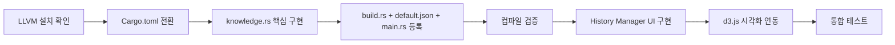

# 구현 계획서: 3단계 — History Manager 및 Oxigraph 지식 그래프 엔진 구축

## 개요

로드맵 v2의 3단계로서, `petgraph`(인메모리 그래프)를 제거하고 **Oxigraph**(RDF/RocksDB 온디스크 영구 저장소)로 전환합니다.
새로운 **History Manager** 모듈을 통해 완료된 프로젝트의 BOM(부품명세서), 핵심 산출물, 프로젝트 메타정보를 전사 공통 지식 자산 DB에 적재하고, SPARQL 쿼리와 d3.js 시각화로 부품 호환성/프로젝트 이력을 즉시 조회할 수 있도록 구현합니다.

---

## 사용자 검토 필수 사항

> [!CAUTION]
> ### 사전 환경 설정 필요: LLVM/Clang 설치
> Oxigraph는 RocksDB(C++ 라이브러리)를 내장 컴파일합니다. 현재 개발 환경에 **LLVM/Clang이 설치되어 있지 않습니다.**
> 
> 코드 구현에 착수하기 전에 아래 단계를 수행해 주세요:
> 1. [LLVM 공식 다운로드](https://github.com/llvm/llvm-project/releases) 페이지에서 **LLVM-xx.x.x-win64.exe** 설치
> 2. 설치 시 **"Add LLVM to the system PATH"** 옵션 체크
> 3. 환경변수 설정: `LIBCLANG_PATH=C:\Program Files\LLVM\lib`
> 4. 터미널 재시작 후 `clang --version` 명령으로 설치 확인

> [!IMPORTANT]
> ### 아키텍처 전환: Two-Track Storage
> - **개인 업무 스토리지** (`workassist_user.db`): 기존 SQLite — Task, Minutes, Projects 데이터 (변경 없음)
> - **공통 지식 자산 스토리지** (신설):
>   - `Oxigraph` (RDF/RocksDB): 부품 호환성, 프로젝트 히스토리, BOM 관계 영구 저장
>   - `LanceDB`: 사양서/산출물 본문의 384차원 의미론적 벡터 임베딩
>   - `SQLite specs 테이블`: 이기종 부품 사양 JSON 메타데이터 (기존 유지)

---

## 변경 사항 및 설계 계획

### Phase 1: 백엔드 인프라 전환

---

#### [MODIFY] [Cargo.toml](file:///C:/Users/user/Desktop/Work/SJautomation/Antigravity/SJ_WorkAssist/workassist-v2/src-tauri/Cargo.toml)
- `petgraph = "0.6.5"` 제거
- `oxigraph = "0.5"` 추가

#### [NEW] [knowledge.rs](file:///C:/Users/user/Desktop/Work/SJautomation/Antigravity/SJ_WorkAssist/workassist-v2/src-tauri/src/modules/knowledge.rs)
신설하는 Oxigraph 지식 그래프 관리 전용 모듈. 핵심 내용:

- **`KnowledgeStore` 구조체**: `oxigraph::store::Store`를 `Arc<Mutex<>>`로 래핑하여 Tauri 상태로 관리
- **스토어 초기화**: `%LOCALAPPDATA%/SJ_WorkAssist/oxigraph_data/` 경로에 온디스크 스토어 생성
- **RDF 네임스페이스 정의**:
  ```
  PREFIX wa: <http://workassist.local/ontology/>
  PREFIX rdf: <http://www.w3.org/1999/02/22-rdf-syntax-ns#>
  PREFIX xsd: <http://www.w3.org/2001/XMLSchema#>
  ```

##### Tauri 커맨드 구현 목록:

| 커맨드 | 설명 |
|--------|------|
| `register_project` | 프로젝트 메타(코드, 담당자, 고객사 등)를 RDF 트리플로 Oxigraph에 적재 |
| `ingest_bom` | 엑셀 BOM을 calamine으로 파싱 → 품번/수량/프로젝트 관계를 RDF 트리플로 변환/적재 |
| `ingest_project_document` | 산출물 PDF를 opendataloader-pdf로 파싱 → 프로젝트 코드 메타태그 바인딩 → LanceDB 벡터 적재 |
| `query_knowledge` | 자유 SPARQL SELECT 쿼리 실행 → JSON 배열 결과 반환 |
| `get_graph_data` | 특정 엔티티 중심의 RDF 서브그래프를 d3.js용 `{nodes: [], links: []}` JSON으로 변환 |
| `delete_knowledge_entity` | 대상 URI 관련 모든 트리플을 Oxigraph에서 원자적 삭제 + LanceDB 연동 벡터 삭제 |
| `get_all_projects` | 등록된 모든 프로젝트 목록을 SPARQL로 조회하여 JSON 배열 반환 |

#### [MODIFY] [mod.rs](file:///C:/Users/user/Desktop/Work/SJautomation/Antigravity/SJ_WorkAssist/workassist-v2/src-tauri/src/modules/mod.rs)
- `pub mod knowledge;` 모듈 등록 (feature gate: `#[cfg(feature = "rag")]`)

#### [MODIFY] [main.rs](file:///C:/Users/user/Desktop/Work/SJautomation/Antigravity/SJ_WorkAssist/workassist-v2/src-tauri/src/main.rs)
- `KnowledgeStore` 인스턴스를 Tauri `manage()` 상태로 등록
- `knowledge::init()` 플러그인 등록

#### [MODIFY] [build.rs](file:///C:/Users/user/Desktop/Work/SJautomation/Antigravity/SJ_WorkAssist/workassist-v2/src-tauri/build.rs)
- `"knowledge"` 인라인 플러그인 등록: 7개 커맨드 전부 선언

#### [MODIFY] [default.json](file:///C:/Users/user/Desktop/Work/SJautomation/Antigravity/SJ_WorkAssist/workassist-v2/src-tauri/capabilities/default.json)
- `knowledge:allow-register-project`, `knowledge:allow-ingest-bom`, `knowledge:allow-ingest-project-document`, `knowledge:allow-query-knowledge`, `knowledge:allow-get-graph-data`, `knowledge:allow-delete-knowledge-entity`, `knowledge:allow-get-all-projects` 권한 추가

---

### Phase 2: RDF 온톨로지 설계

#### 네임스페이스 URI 체계
```
wa:Component_MAXON_ECX22    rdf:type           wa:Component .
wa:Component_MAXON_ECX22    wa:partNumber      "MAXON-ECX-22" .
wa:Component_MAXON_ECX22    wa:category        "Motor" .
wa:Component_MAXON_ECX22    wa:compatibleWith  wa:Component_ENCODER_12X .

wa:Project_PRJ2026DRONE     rdf:type           wa:Project .
wa:Project_PRJ2026DRONE     wa:projectCode     "PRJ-2026-DRONE" .
wa:Project_PRJ2026DRONE     wa:customer        "삼성중공업" .
wa:Project_PRJ2026DRONE     wa:manager         "홍길동" .
wa:Project_PRJ2026DRONE     wa:hasBOMItem      wa:BOM_PRJ2026DRONE_01 .

wa:BOM_PRJ2026DRONE_01      rdf:type           wa:BOMItem .
wa:BOM_PRJ2026DRONE_01      wa:partNumber      "MAXON-ECX-22" .
wa:BOM_PRJ2026DRONE_01      wa:quantity         "4"^^xsd:integer .
```

---

### Phase 3: 프론트엔드 UI

#### [MODIFY] [index.html](file:///C:/Users/user/Desktop/Work/SJautomation/Antigravity/SJ_WorkAssist/workassist-v2/ui/index.html)
사이드바 메뉴에 **History Manager** 네비게이션 항목 추가 (`nav-history`)

신설 뷰 `#view-history` 구성:
1. **프로젝트 등록 카드**: 프로젝트 코드, 프로젝트명, 담당자, 고객사, 개요 입력 폼 → `register_project` 호출
2. **BOM Import 카드**: 엑셀 파일 선택 + 프로젝트 코드 연결 드롭다운 → `ingest_bom` 호출
3. **산출물 등록 아코디언**: PDF 파일 선택 + 문서 종류(요구사양서, 설계명세서, DR자료) + 프로젝트 코드 연결 → `ingest_project_document` 호출
4. **지식 그래프 시각화 영역**: d3.js force-directed graph 렌더링 캔버스 + SPARQL 결과 테이블

#### [MODIFY] [app.js](file:///C:/Users/user/Desktop/Work/SJautomation/Antigravity/SJ_WorkAssist/workassist-v2/ui/app.js)
- `loadView()`에 `'nav-history'` 뷰 매핑 추가
- `setupHistory()` 초기화 함수 구현:
  - 프로젝트 등록 폼 바인딩
  - BOM Import 핸들러 (calamine → RDF 적재)
  - 산출물 등록 핸들러 (opendataloader-pdf → LanceDB 적재)
  - d3.js force-directed graph 렌더링 (SVG 기반 노드-링크 다이어그램)
  - SPARQL 자유 쿼리 실행 및 결과 테이블 렌더링

---

## 구현 순서 (단계적 진행)



## 검증 계획

### 컴파일 검증
- Oxigraph + RocksDB가 Windows MSVC 환경에서 경고 없이 빌드되는지 확인

### 기능 검증
1. **프로젝트 등록**: 폼 입력 → Oxigraph에 RDF 트리플 생성 확인
2. **BOM Import**: 엑셀 BOM → 품번/수량 RDF 관계 적재 확인
3. **산출물 인덱싱**: PDF → 프로젝트 코드 태깅된 벡터 LanceDB 적재 확인
4. **SPARQL 검색**: 자연어 질의어 → 부품 스펙 + 호환 부품 + 프로젝트 이력 복합 조회 확인
5. **d3.js 시각화**: 노드-링크 다이어그램이 정상 렌더링되는지 확인
6. **데이터 삭제**: 특정 프로젝트 삭제 시 Oxigraph + LanceDB 연쇄 삭제 확인
